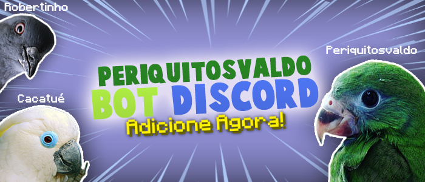

# :parrot: Periquitosvaldo Bot Open-Source

## `1º` **|** Introdução:



<p>
<a href="https://twitter.com/tiagoinsany"></a>
<a href="https://www.periquitovaldo.ga"></a>
</a>
<a href="https://www.patreon.com/TiaGoiNsaNy"></a> 
<a href="https://www.paypal.com/donate/?cmd=_donations&business=K4DA7PQ8N2NDY&item_name=Ajudar+a+melhorar+a+hospedagem+do+Periquitosvaldo+Bot&currency_code=BRL"></a>

</p>

:blush: Periquitosvaldo Bot Open-Source? Sim, deixei ele livre para estudos e verem como foi desenvolvido os sistemas dele!

## `2º` **|** Estruturação:

:wrench: O Periquitosvaldo Bot foi feito usando a linguagem **JavaScript** e tendo como livraria de conecção com a **API** do **Discord**  a **Discord.js**, para o Banco de Dados, eu usei o **Firebase Realtime Database**.

:cop: Usando o conceito de **Variaveis Locais** para armazenamento de chaves da Aplicação e do banco de dados, assim melhorando a segurança do Periquitosvaldo!

#### :gear: **- Arquivo** `.env`

```
# Aplication Key

TOKEN=

# Firebase Keys

FB_API_KEY=
FB_AUTH_DOMAIN=
FB_DATABASE_URL=
FB_PROJECT_ID=
FB_STORE_BUCKET=
FB_MESSAGE_SEND_ID=
FB_APP_ID=
```

#### :open_file_folder: **- Todas as Dependências Usadas**
- `colors@1.4.0`
- `discord.js@12.5.1`
- `dotenv@8.2.0`
- `express@4.17.1`
- `firebase@8.2.0`
- `fs@0.0.1-security`
- `jimp@0.16.1`
- `millify@3.5.2`
- `moment@2.29.1`
- `nekos.life@2.0.7`
- `node-fetch@2.6.1`
- `number-formatter@1.2.0`
- `parse-ms@2.1.0`
- `path@0.12.7`
- `quick.db@7.1.3`

#### :electric_plug: **- Script de Inicialização**
```shell
$ npm run dev
```

## `3º` **|** Links:

:link: Todos os links abaixos estão liberados, espero que veja todos.
> - [:bird: Twitter TiaGoiNsaNy](https://twitter.com/TiaGoiNsaNy)
> - [:moneybag: Meu Patreon](https://patreon.com/TiaGoiNsaNy)
> - [:moneybag: Doações](https://www.paypal.com/donate/?cmd=_donations&business=K4DA7PQ8N2NDY&item_name=Ajudar+a+melhorar+a+hospedagem+do+Periquitosvaldo+Bot&currency_code=BRL)

## `4º` **|** Menções Incriveis:

:star: Abaixo está o criador de todo o repositório e de mim, o programador TiaGoiNsaNy, sem ele eu não estaria hoje aqui!

| [<br><sub>@TiaGoiNsaNy</sub>](https://github.com/TiaGoiNsaNy) |
| :---: |  
